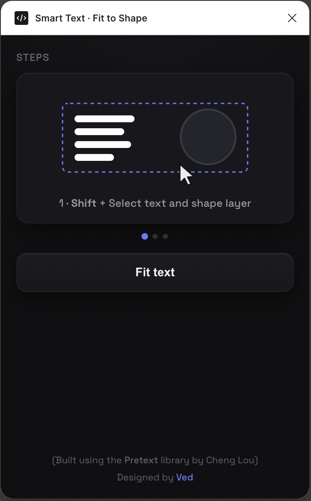

# Smart Text · Fit to Shape

A Figma plugin that fits any text layer neatly inside a shape or box — **circle, box, star, or logo — in one click**. It scales the font to the largest size that fits and reflows the text to the shape's silhouette, with live controls for padding and width.

> **Community listing:** https://www.figma.com/community/plugin/1656598363853805099

<p align="center">
  
</p>

---

## Features

- **Fit text to any shape** — select a text layer + a shape, click **Fit text**, and the text sizes and reflows to fill it.
- **Shape-aware layout:**
  - **Rectangles / squares** → filled, left-aligned, with padding (like a normal text box).
  - **Circles, ellipses, diamonds, stars, convex logos** → centered lines that follow the silhouette.
- **Accurate measurement** via the [Pretext](https://github.com/chenglou/pretext) text-layout library.
- **Font-width calibration** — measures the real font width in Figma and corrects Pretext's canvas measurement, so line breaks match what Figma renders (no orphan words) even for fonts the plugin canvas can't measure.
- **Live sliders** — tune **Padding** and **Width fill**; the panel re-fits as you drag, and applies on release.
- **One-button flow** — analyse + apply in a single click. Settings persist across sessions.
- **Dark, self-contained UI** — Space Grotesk embedded, no network access.

## How it works

1. `code.ts` (Figma sandbox) reads the selected text + shape, measures the font's real width with a throwaway node, and sends everything to the UI.
2. `ui.js` (UI iframe, bundled with Pretext) rasterizes the shape's `fillGeometry` into a mask, then:
   - **Rectangle-like shapes** (fill ≥ 90 % of their bounding box) → greedy word-wrap to a padded inner box.
   - **Tapered shapes** → binary-search the largest font whose lines each fit the shape's width at their height, centered into a silhouette.
   - Both correct for the Pretext-vs-Figma width mismatch and pin the line height so the result can't overflow.
3. On apply, `code.ts` writes the new font size, line breaks, alignment, and position back to the text layer.

Everything runs locally — the manifest declares `networkAccess: "none"`, so the UI, the Pretext bundle, and the font are all inlined into `ui.html`.

## Build & run

```bash
npm install
npm run build          # tsc compiles code.ts → code.js, then build.js bundles ui.js + font into ui.html
```

Then in Figma (desktop): **Plugins → Development → Import plugin from manifest…** → select `manifest.json`, and run **Smart Text · Fit to Shape**.

Watch mode: `npm run build -- --watch`.

### The build step

Figma plugin UIs are injected via `srcdoc` with no origin, so an external `<script src>` can't load. `build.js`:
- bundles `ui.js` (with Pretext) via esbuild and **inlines** it into `ui.html` between `BUNDLE` markers, and
- base64-embeds `space-grotesk.woff2` as an `@font-face` between `FONT` markers.

So `ui.html` is fully self-contained.

## Project structure

| File | Purpose |
|---|---|
| `code.ts` | Figma sandbox logic — read selection, measure font, apply the fit |
| `ui.js` | UI logic + the fitting engine (Pretext) |
| `ui.html` | Plugin UI (styles + inlined bundle + inlined font) |
| `build.js` | esbuild bundling + font/bundle inlining |
| `manifest.json` | Plugin config (`documentAccess: dynamic-page`, `networkAccess: none`) |
| `icon.svg` | Plugin icon (export to 128×128 PNG for publishing) |
| `space-grotesk.woff2` | Embedded UI font |

## Credits

- Text measurement & layout: **[Pretext](https://github.com/chenglou/pretext)** by Cheng Lou.
- Font: **[Space Grotesk](https://github.com/floriankarsten/space-grotesk)**.
- Built and designed by **[Ved](https://x.com/rugvedvaidya)**.
